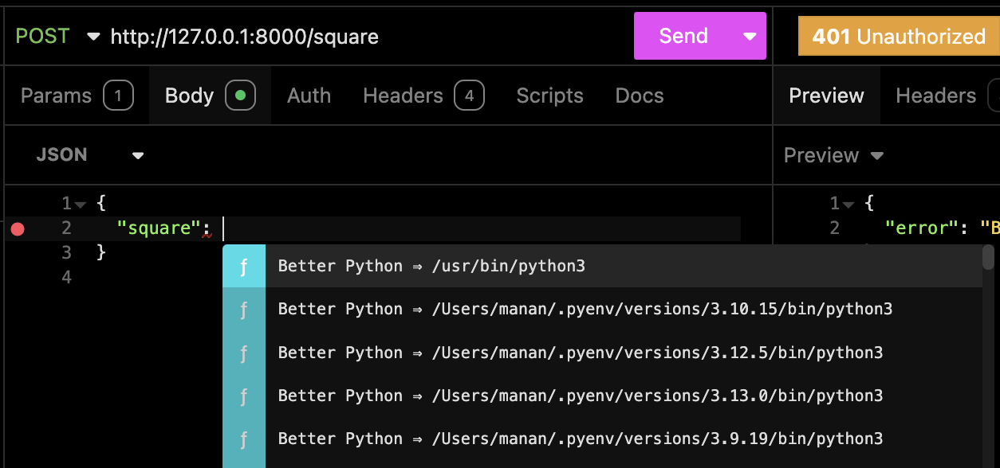
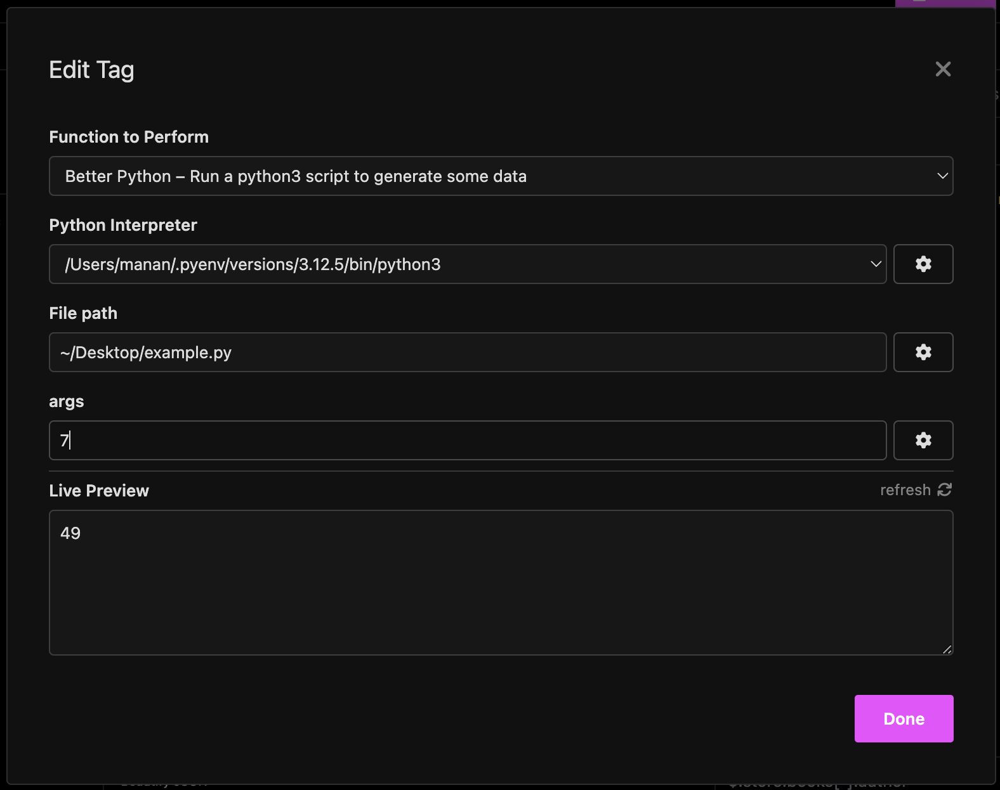

# Better Python

Run Python files from inside Insomnia! 

## Installation

1. Open Insomnia
2. Go to Application > Preferences > Plugins
3. Type `insomnia-plugin-better-python` in the search bar
4. Install the plugin

## Usage

Write your Python code in a file and save it. The output from stdout will be used as the plugin's response.

For instance, inside a file called "example.py":

```python
import sys

USAGE_MESSAGE = f'Usage: python {sys.argv[0]} <number>'

def square(n: int) -> int:
    return n ** 2

if __name__ == '__main__':
    try:
        n = int(sys.argv[1])
        print(square(n))
    except (IndexError, ValueError):
        print(USAGE_MESSAGE)
        sys.exit(-1)
```

To run this script from Insomnia:

- Create a new request
- Hit `Ctrl+Space` to open the plugin dropdown
- Select `Better Python` and click on the new button that was inserted



- Choose your Python interpreter and the file you want to run
- Provide any arguments you want to pass to the script
- Hit `Done` and then `Run`



## Credits

Heavily inspired by [insomnia-plugin-python-script](https://github.com/Wuerike/insomnia-plugin-python-script) by @Wuerike.
